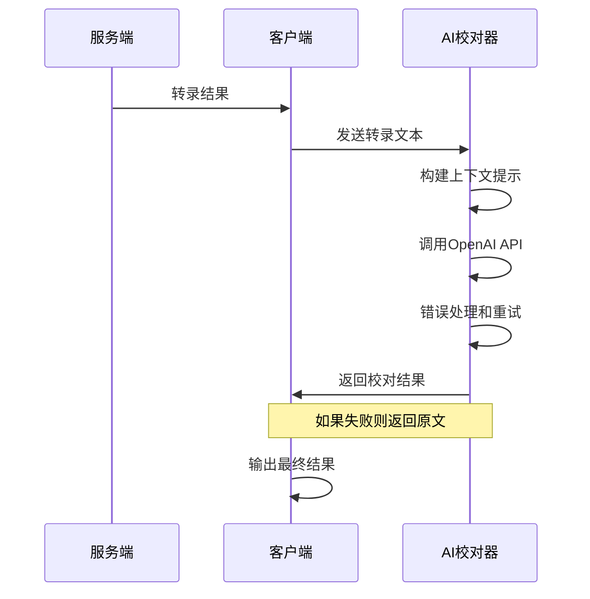

# AI文本校对和润色功能

CapsWriter Offline 现在支持使用AI对语音转录结果进行校对和润色，使得转录文本更加准确、流畅和易读。

## 功能特性

- **智能校对**：自动纠正语音转录中的错误和不通顺之处
- **上下文感知**：利用前序转录内容提供更准确的校对结果
- **多语言支持**：支持中文和英文文本的校对处理
- **错误处理**：完善的重试机制和错误恢复，确保系统稳定性
- **可选配置**：不启用时不影响原有转录流程

## 配置方法

### 1. 安装依赖

```bash
pip install -r requirements-server.txt
```

### 2. 环境变量配置

复制 `.env.example` 为 `.env` 并填写配置：

```bash
cp .env.example .env
```

在 `.env` 文件中设置：

```env
# OpenAI API配置
OPENAI_BASE_URL=https://api.openai.com/v1
OPENAI_MODEL=gpt-4o-mini
OPENAI_API_KEY=your_api_key_here
```

**支持的服务提供商：**
- OpenAI 官方API
- Azure OpenAI Service
- 兼容OpenAI格式的本地服务（如ollama、vllm等）

### 3. 启用AI功能

在 `src/capswriter/config.py` 中启用AI增强：

```python
class ClientConfig:
    # ...其他配置...
    ai_enhancement = True  # 启用AI校对润色功能
    ai_context_segments = 5  # 上下文段数，默认5段
```

## 使用方法

启用配置后，AI校对功能会自动在转录完成时运行：

1. **实时录音**：松开录音键后，系统会先显示原始转录结果，然后显示AI校对后的结果
2. **文件转录**：转录完成后，最终结果会经过AI校对处理

## 工作原理

### 处理流程



### 上下文机制

AI校对器会记录最近的转录结果作为上下文，帮助提供更准确的校对：

- 默认记录前5段转录结果
- 上下文信息会随每次请求一起发送给AI
- 有助于处理跨段落的语义连贯性

### 错误处理

系统实现了完善的错误处理机制：

1. **重试机制**：最多重试3次
2. **指数退避**：重试间隔逐渐增加（1s, 2s, 4s）
3. **速率限制处理**：自动处理429状态码
4. **服务器错误处理**：处理5xx系列错误
5. **超时保护**：30秒请求超时
6. **降级机制**：AI失败时自动回退到原文

## 配置参数说明

### ClientConfig

```python
class ClientConfig:
    ai_enhancement = False  # 是否启用AI校对功能
    ai_context_segments = 5  # 记录的上下文段数
```

### AIConfig

```python
class AIConfig:
    base_url = 'https://api.openai.com/v1'  # API端点
    model = 'gpt-4o-mini'  # 使用的模型
    api_key = ''  # API密钥
    max_retries = 3  # 最大重试次数
    timeout = 30.0  # 请求超时时间
    max_tokens = 2048  # 最大返回token数
```

## 测试方法

运行测试脚本验证功能：

```bash
cd tests
python test_ai_enhancer.py
```

测试脚本会验证：
- 配置是否正确
- API连接是否正常
- 各种文本的校对效果
- 上下文功能是否工作

## 常见问题

### Q: AI功能不工作怎么办？

1. 检查 `.env` 文件中的API密钥是否正确
2. 确认 `ClientConfig.ai_enhancement = True`
3. 检查网络连接和API服务状态
4. 查看客户端日志中的错误信息

### Q: 如何选择合适的模型？

- **gpt-4o-mini**：推荐选择，性价比高，处理速度快
- **gpt-3.5-turbo**：成本更低，基本校对功能
- **gpt-4**：质量更高，但成本和延迟较高

### Q: 校对延迟太长怎么办？

1. 选择响应更快的模型（如gpt-3.5-turbo）
2. 使用地理位置更近的API服务
3. 减少 `max_tokens` 参数值
4. 考虑使用本地部署的模型服务

### Q: 如何自定义校对规则？

目前校对规则内置在AI模块中，基于参考的prompt进行优化。如需自定义，可以修改 `src/capswriter/client/utils/ai_enhancer.py` 中的 `_build_prompt` 方法。

## 安全注意事项

1. **API密钥安全**：
   - 不要将API密钥提交到版本控制
   - 使用环境变量存储敏感信息
   - 定期轮换API密钥

2. **数据隐私**：
   - 转录内容会发送到AI服务进行处理
   - 如有隐私要求，建议使用本地部署的AI服务
   - 考虑对敏感内容进行预处理

3. **网络安全**：
   - 使用HTTPS连接
   - 在防火墙中适当配置访问规则

## 故障排除

### 日志查看

客户端会输出详细的AI处理日志：

- 成功时显示原文和校对结果
- 失败时显示具体错误信息
- 重试时显示重试次数和延迟时间

### 常见错误

1. **"未配置API密钥"**：需要在.env文件中设置OPENAI_API_KEY
2. **"API请求超时"**：检查网络连接或增加timeout值
3. **"速率限制"**：API调用频率过高，系统会自动重试
4. **"模型不存在"**：检查model参数是否正确

如需更多帮助，请查看项目的GitHub Issues页面。