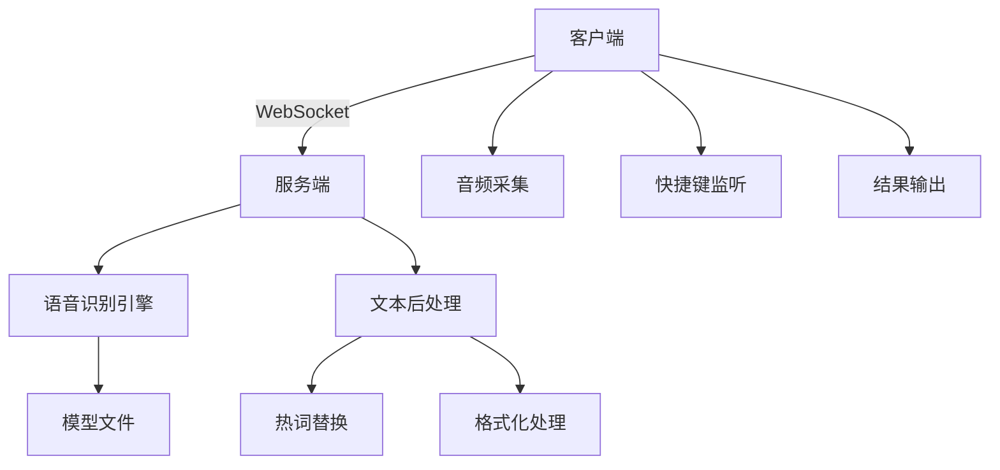
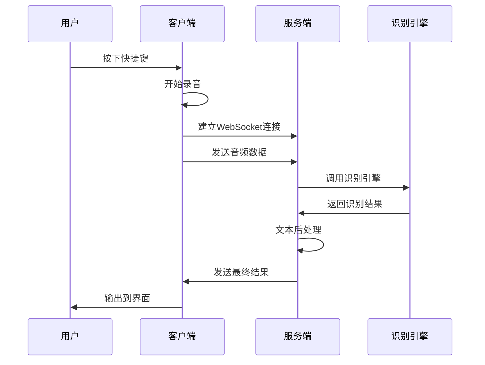
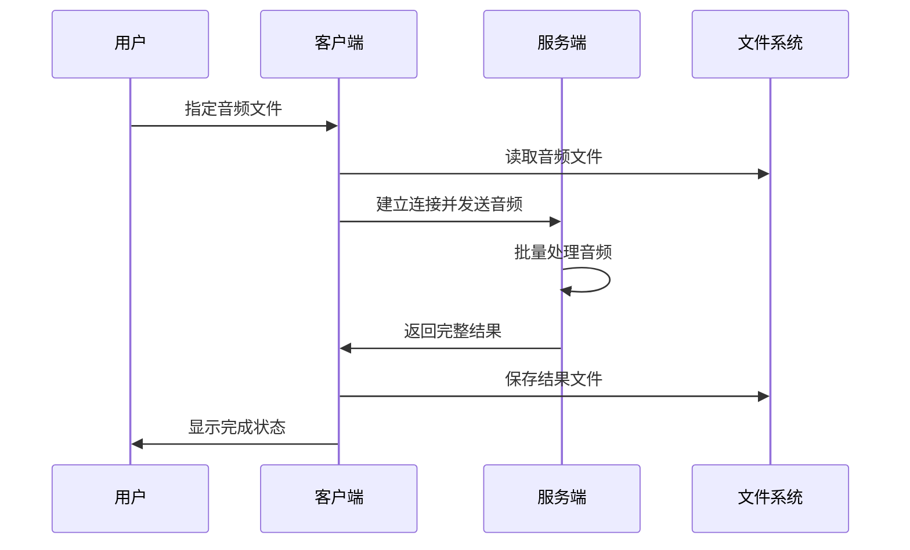

# 系统架构

## 整体架构

CapsWriter Offline 采用客户端-服务端分离的架构设计，支持分布式部署和使用。

## 核心组件

### 1. 客户端 (Client)

位于 `src/capswriter/client/` 目录，负责：

- **音频采集**：通过麦克风或音频文件获取音频数据
- **快捷键监听**：监听用户定义的快捷键操作
- **WebSocket 通信**：与服务端建立实时通信连接
- **结果输出**：将识别结果输出到用户界面或文件

#### 主要模块：

- `core.py`：客户端核心逻辑
- `utils/`：客户端工具函数
  - `client_stream.py`：音频流处理
  - `client_shortcut_handler.py`：快捷键处理
  - `client_send_audio.py`：音频发送
  - `client_recv_result.py`：结果接收
  - `client_cosmic.py`：全局状态管理

### 2. 服务端 (Server)

位于 `src/capswriter/server/` 目录，负责：

- **WebSocket 服务**：提供实时通信服务
- **语音识别**：调用语音识别引擎处理音频
- **文本后处理**：格式化和优化识别结果
- **模型管理**：加载和管理语音识别模型

#### 主要模块：

- `core.py`：服务端核心逻辑
- `utils/`：服务端工具函数
  - `server_ws_recv.py`：WebSocket 接收处理
  - `server_ws_send.py`：WebSocket 发送处理
  - `server_recognize.py`：语音识别逻辑
  - `server_init_recognizer.py`：识别器初始化
  - `server_cosmic.py`：全局状态管理

### 3. 通用工具 (Utils)

位于 `src/capswriter/utils/` 目录，提供共用功能：

- **热词处理**：
  - `hot_sub_zh.py`：中文热词替换
  - `hot_sub_en.py`：英文热词替换
  - `hot_sub_rule.py`：规则替换
  - `hot_kwds.py`：关键词处理

- **文本处理**：
  - `chinese_itn.py`：中文数字转换
  - `format_tools.py`：文本格式化
  - `srt_from_txt.py`：SRT字幕生成

- **系统工具**：
  - `my_status.py`：状态管理
  - `empty_working_set.py`：内存优化
  - `asyncio_to_thread.py`：异步处理

## 数据流

### 1. 实时语音识别流程

### 2. 文件转录流程

## 配置管理

### 配置文件结构

`src/capswriter/config.py` 包含两个主要配置类：

- **`ServerConfig`**：服务端配置
  - 网络设置（地址、端口）
  - 处理选项（数字转换、标点符号、空格调整）

- **`ClientConfig`**：客户端配置
  - 服务器连接信息
  - 快捷键和操作模式
  - 输出设置

## 扩展性设计

### 1. 模块化设计

- 各功能模块高度解耦
- 统一的接口设计
- 便于添加新功能

### 2. 插件化支持

- 热词替换系统支持自定义规则
- 文本后处理支持自定义格式化
- 输出系统支持多种格式

### 3. 多平台兼容

- 使用跨平台的 Python 库
- 针对不同操作系统的特殊处理
- 统一的配置和部署方式

## 性能优化

### 1. 内存管理

- 异步处理减少阻塞
- 音频流分块处理
- 及时释放不用的资源

### 2. 网络优化

- WebSocket 实时通信
- 音频数据压缩传输
- 连接状态监控和恢复

### 3. 并发处理

- 多进程语音识别
- 异步 I/O 操作
- 队列缓冲机制